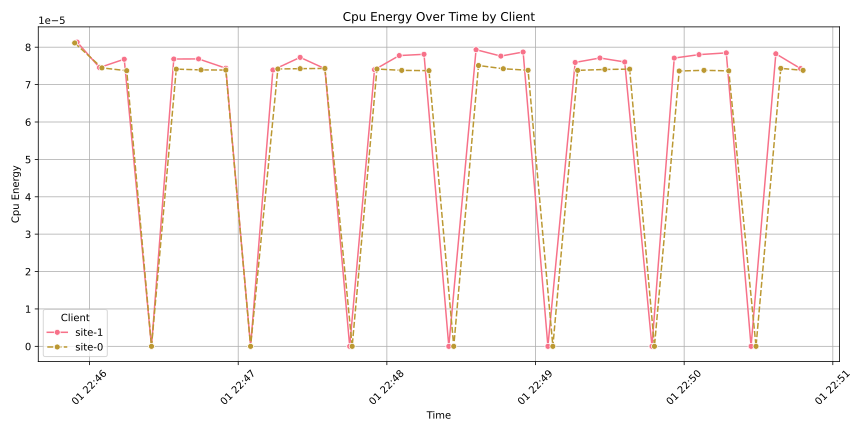
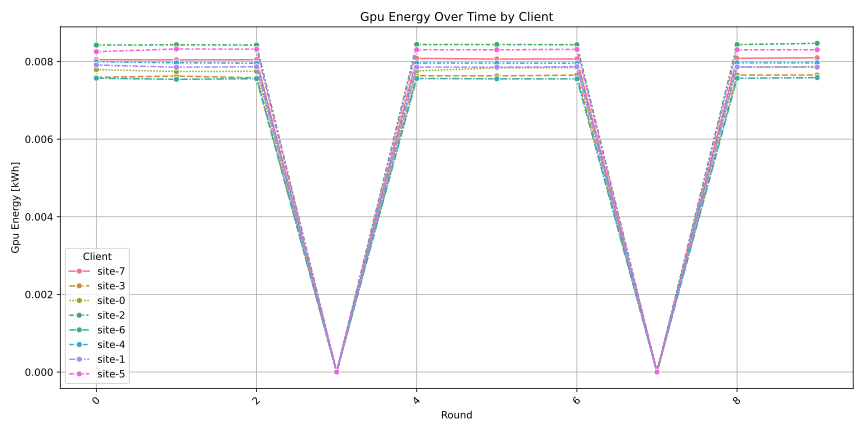
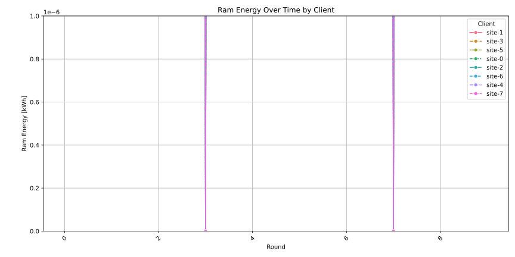
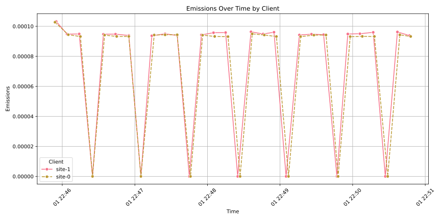
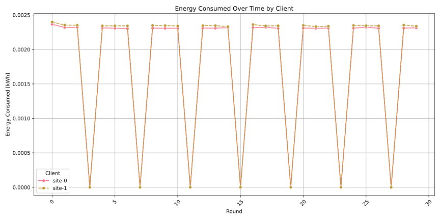

# Carbon Footprint Example with NVFlare

This example demonstrates how to measure the carbon footprint of federated learning using [CodeCarbon](CodeCarbon.io) in offline mode.

## Prerequisites

1. Create a virtual environment:
```bash
python -m venv .venv
```

2. Activate the virtual environment:
```bash
source .venv/bin/activate
```

3. Install NVFlare and required dependencies:
```bash
pip install -r requirements.txt
```

## Running the Example

1. Download the data
```bash
DATASET_ROOT="/tmp/nvflare/data"

python3 -c "import torchvision.datasets as datasets; datasets.CIFAR10(root='${DATASET_ROOT}', train=True, download=True)"
```

1. Run the example:
```bash
python job.py
```

## Understanding the Output

The example will:
1. Create a federated learning job with 2 clients
2. Run for 2 rounds
3. Measure and report carbon emissions in offline mode

The carbon emissions data will be saved in a CSV file in the current directory, typically named `emissions.csv` under each clients workdir in `/tmp/nvflare/carbon_footprint`. 

You can check the rsult using, e.g. 

```bash
cat /tmp/nvflare/carbon_footprint/site-0/emissions.csv
```

The FL server also collects the results of all clients. These can be shown via

```bash
cat /tmp/nvflare/carbon_footprint/server/client_emissions.csv
```

## Plotting the Results


To visualize the carbon emissions data from all clients:

1. Run the plotting script:
```bash
python plot_emissions.py --emissions_csv_file /tmp/nvflare/carbon_footprint/server/client_emissions.csv
```

The resulting plots should look like
<div style="display: flex; justify-content: center; gap: 20px; flex-wrap: nowrap;">



</div>

<div style="display: flex; justify-content: center; gap: 20px; flex-wrap: nowrap;">


</div>


This will generate a plots showing the energy consumptions and carbon emissions over time for each client and save them under `./figs`.