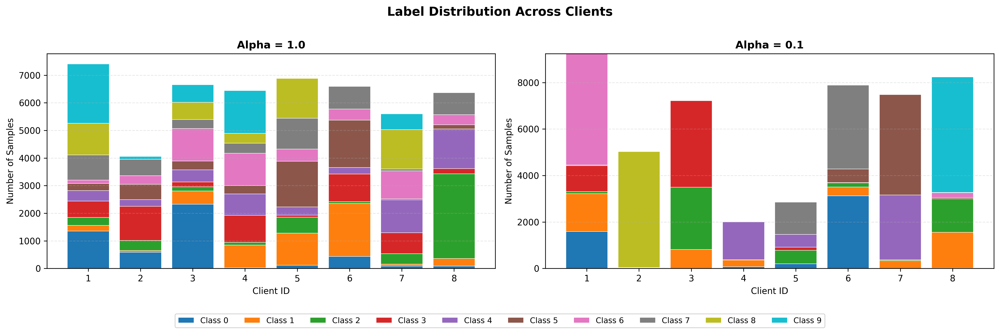
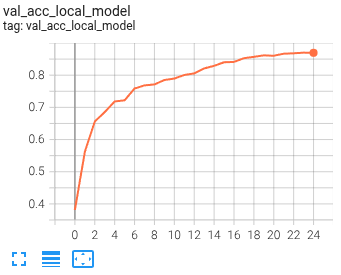
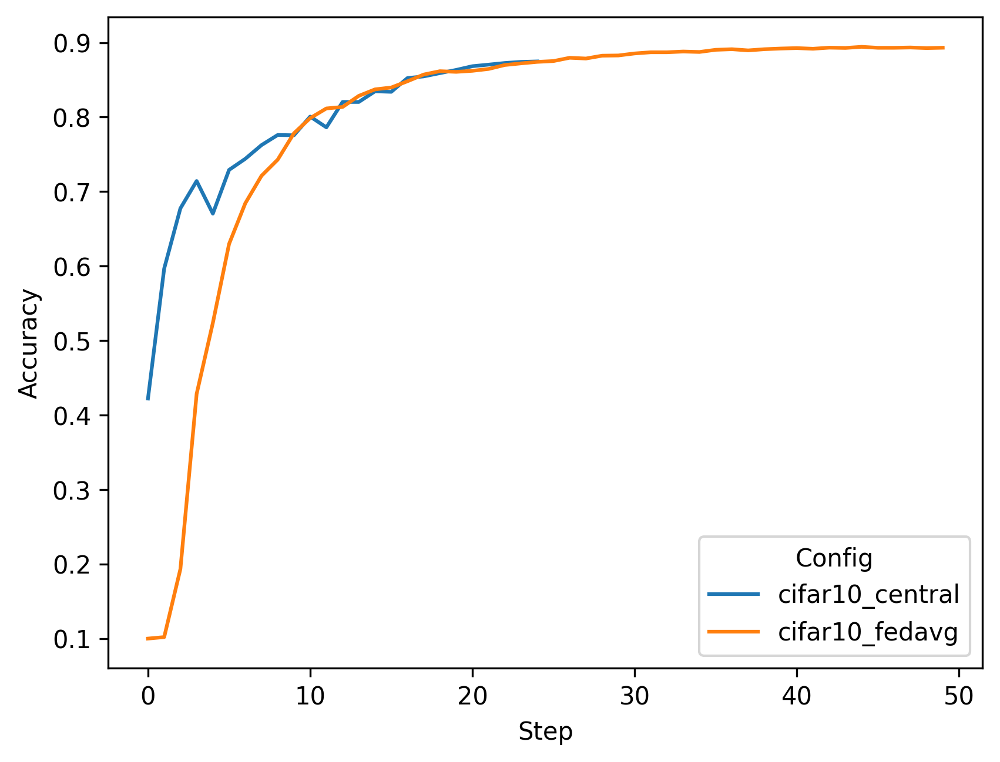
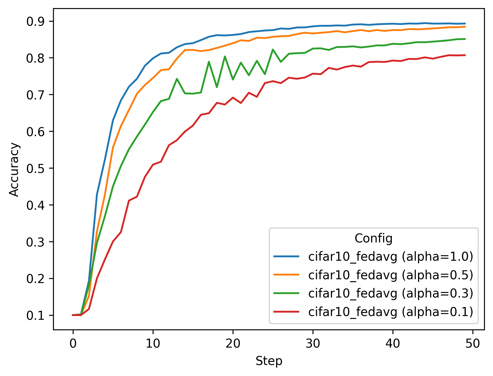
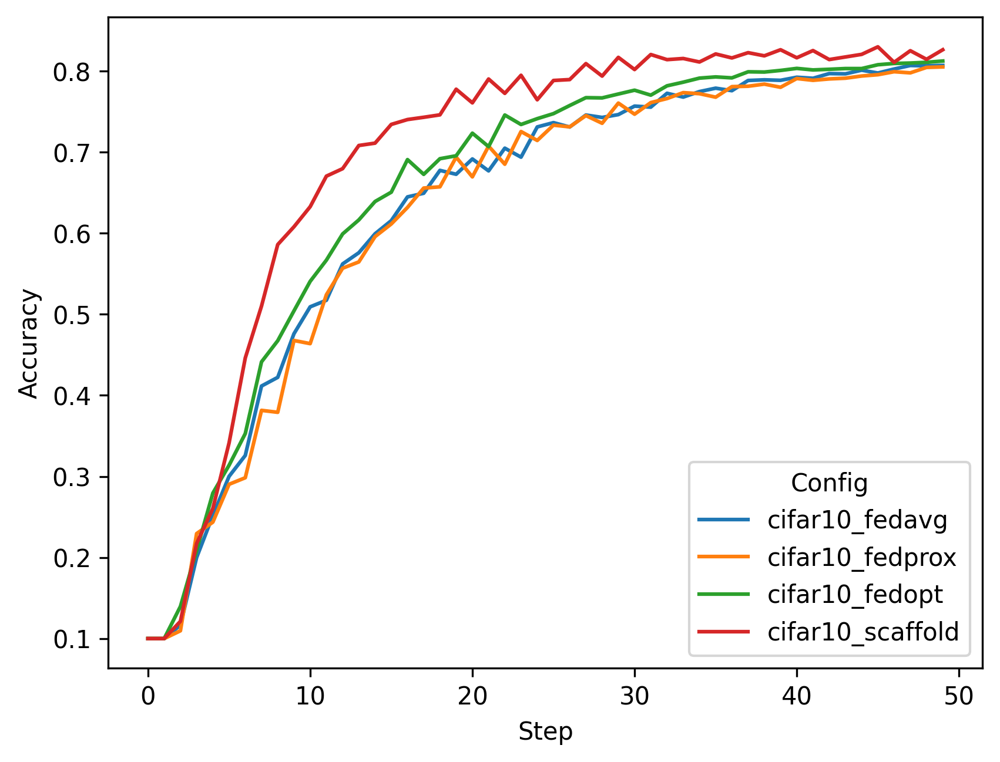

# Simulated Federated Learning with CIFAR-10

This example includes instructions on running [FedAvg](https://arxiv.org/abs/1602.05629), 
[FedProx](https://arxiv.org/abs/1812.06127), [FedOpt](https://arxiv.org/abs/2003.00295), 
and [SCAFFOLD](https://arxiv.org/abs/1910.06378) algorithms using NVFlare's FL simulator.

For instructions of how to run CIFAR-10 in deployment settings, 
see the example on ["Real-world Federated Learning with CIFAR-10"](../cifar10-real-world/README.md).

## 1. Install requirements

Install required packages for training
```
pip install --upgrade pip
pip install -r ./requirements.txt
```

> **_NOTE:_**  We recommend either using a containerized deployment or virtual environment, 
> please refer to [getting started](https://nvflare.readthedocs.io/en/latest/getting_started.html).

Set `PYTHONPATH` to include custom files of this example:
```
export PYTHONPATH=${PWD}/../src
```

## 2. Download the CIFAR-10 dataset 
To speed up the following experiments, first download the [CIFAR-10](https://www.cs.toronto.edu/~kriz/cifar.html) dataset:
```
./prepare_data.sh
```

> **_NOTE:_** This is important for running multitask experiments or running multiple clients on the same machine.
> Otherwise, each job will try to download the dataset to the same location which might cause a file corruption.


## 3. Run simulated FL experiments

We are using NVFlare's [FL simulator](https://nvflare.readthedocs.io/en/latest/user_guide/nvflare_cli/fl_simulator.html) to run the following experiments. 

Jobs are executed using the recipe pattern: `python ./jobs/<job_name>/job.py [arguments]`

> **_NOTE:_** By default, all experiments use a **cosine annealing learning rate scheduler** that smoothly decays the learning rate over all FL rounds. To disable this, add `--no_lr_scheduler` to the training arguments.

### 3.1 Varying data heterogeneity of data splits

We use an implementation to generate heterogeneous data splits from CIFAR-10 based on a Dirichlet sampling strategy 
from FedMA (https://github.com/IBM/FedMA), where `alpha` controls the amount of heterogeneity, 
see [Wang et al.](https://arxiv.org/abs/2002.06440).

The `--alpha` parameter controls data heterogeneity:
- Higher alpha (e.g., 1.0) = more uniform/homogeneous data distribution across clients
- Lower alpha (e.g., 0.1) = more heterogeneous/non-IID data distribution across clients

#### Visualizing Label Distributions

To understand how the `alpha` parameter affects data distribution across clients, you can visualize the label distributions using the provided plotting script.

Then generate the visualizations:

```bash
python3 ./figs/plot_label_distributions.py --alpha_values 1.0 0.1 --n_clients 8
```

This will generate a stacked bar chart in the `figs` directory with stacked bar charts showing the actual sample counts per class:



### 3.2 Centralized training

To simulate a centralized training baseline, we run FL with 1 client for 25 local epochs but only for one round. 
It takes circa 5 minutes on an NVIDIA A6000 GPU.
```
python ./jobs/cifar10_central/job.py --epochs 25
```
Note: The centralized training uses `alpha=0.0`, meaning no heterogeneous data splits are generated (all data is used by the single client).

You can visualize the training progress by running `tensorboard --logdir=/tmp/nvflare/simulation`


### 3.3 FedAvg on different data splits

FedAvg (8 clients). Here we run for 50 rounds, with 4 local epochs. This corresponds roughly 
to the same number of iterations across clients as in the central baseline above (50*4 epochs divided by 8 clients is 25):
Each job will takes about 10 minutes, depending on your system or how many you run in parallel.

You can copy the whole block into the terminal, and it will execute each experiment one after the other.
```
python ./jobs/cifar10_fedavg/job.py --n_clients 8 --num_rounds 50 --alpha 1.0
python ./jobs/cifar10_fedavg/job.py --n_clients 8 --num_rounds 50 --alpha 0.5
python ./jobs/cifar10_fedavg/job.py --n_clients 8 --num_rounds 50 --alpha 0.3
python ./jobs/cifar10_fedavg/job.py --n_clients 8 --num_rounds 50 --alpha 0.1
```

### 3.4 Advanced FL algorithms (FedProx, FedOpt, and SCAFFOLD)

Next, let's try some different FL algorithms on a more heterogeneous split. Each algorithm addresses different challenges in federated learning with heterogeneous data:

#### 3.4.1 FedProx: Proximal Term for Stability

[FedProx](https://arxiv.org/abs/1812.06127) adds a proximal regularization term to the loss function to prevent client models from drifting too far from the global model during local training. This is particularly effective when clients have heterogeneous data or varying computational capabilities.

**Implementation in client.py** (lines 278-280):
- During training, FedProx adds a proximal loss term: `L_total = L_task + (μ/2) * ||w - w_global||²`
- The `fedproxloss_mu` parameter controls the strength of the regularization
- The `PTFedProxLoss` class computes the L2 distance between local and global model parameters

```python
python ./jobs/cifar10_fedprox/job.py --n_clients 8 --num_rounds 50 --alpha 0.1 --fedproxloss_mu 1e-5
```

#### 3.4.2 FedOpt: Server-Side Adaptive Optimization

[FedOpt](https://arxiv.org/abs/2003.00295) applies adaptive optimization algorithms (like SGD with momentum, Adam, Yogi, or Adagrad) on the server side when aggregating client updates, rather than simple averaging. This allows the global model to benefit from momentum and adaptive learning rates.

**Implementation**:
- This example uses server-side SGD with momentum to update the global model (set in [./jobs/cifar10_fedopt/job.py](./jobs/cifar10_fedopt/job.py))
- Client training remains standard (no changes in client.py)
- The server applies momentum to the aggregated updates before updating the global model

```python
python ./jobs/cifar10_fedopt/job.py --n_clients 8 --num_rounds 50 --alpha 0.1
```

#### 3.4.3 SCAFFOLD: Control Variates for Variance Reduction

[SCAFFOLD](https://arxiv.org/abs/1910.06378) (Stochastic Controlled Averaging for Federated Learning) uses control variates to correct for client drift caused by heterogeneous data. It maintains correction terms (control variates) for both the server and each client.

**Implementation in client.py**:
1. **Initialize control variates**: Each client maintains local control variates `c_local` initialized to zero
2. **Load global control variates**: Server sends global control variates `c_global` with each round
3. **Apply correction during training**: After each optimizer step, SCAFFOLD applies a correction:
   ```
   w = w - lr * (c_global - c_local)
   ```
4. **Update local control variates**: After local training, update control variates:
   ```
   c_local_new = c_local - c_global + (w_global - w_local) / (K * lr)
   ```
   where K is the number of local steps

The implementation follows [NIID-Bench](https://github.com/Xtra-Computing/NIID-Bench) as described in [Li et al.](https://arxiv.org/abs/2102.02079).

```python
python ./jobs/cifar10_scaffold/job.py --n_clients 8 --num_rounds 50 --alpha 0.1
```

**Key Benefits of SCAFFOLD**:
- Reduces variance in client updates due to data heterogeneity
- Enables faster convergence compared to FedAvg
- Particularly effective when clients have highly non-IID data distributions

### 3.5 Running experiments in parallel

If you have several GPUs available in your system, you can run simulations in parallel by adjusting `CUDA_VISIBLE_DEVICES`.
For example, you can run the following commands in two separate terminals:

Terminal 1:
```
export CUDA_VISIBLE_DEVICES=0
python ./jobs/cifar10_fedavg/job.py --n_clients 8 --num_rounds 50 --alpha 0.1
```

Terminal 2:
```
export CUDA_VISIBLE_DEVICES=1
python ./jobs/cifar10_scaffold/job.py --n_clients 8 --num_rounds 50 --alpha 0.1
```

> **_NOTE:_** You can run all experiments mentioned in Section 3 sequentially using the `run_experiments.sh` script.

## 4. Results

Let's summarize the result of the experiments run above. First, we will compare the final validation scores of 
the global models for different settings. In this example, all clients compute their validation scores using the
same CIFAR-10 test set. The plotting script used for the below graphs is in 
[./figs/plot_tensorboard_events.py](./figs/plot_tensorboard_events.py)

> **_NOTE:_** You need to install [./plot-requirements.txt](./plot-requirements.txt) to plot and configure the `experiments` in the script.


### 4.1 Central vs. FedAvg
With a data split using `alpha=1.0`, i.e. a non-heterogeneous split, we achieve the following final validation scores.
One can see that FedAvg can achieve similar performance to central training.

| Config	| Alpha	| 	Val score	| 
| ----------- | ----------- |  ----------- |
| cifar10_central | 1.0	| 	0.8747	| 
| cifar10_fedavg  | 1.0	| 	0.8943	| 



### 4.2 Impact of client data heterogeneity

We also tried different `alpha` values, where lower values cause higher heterogeneity. 
This can be observed in the resulting performance of the FedAvg algorithms.  

| Config |	Alpha |	Val score |
| ----------- | ----------- |  ----------- |
| cifar10_fedavg |	1.0 |	0.8943 |
| cifar10_fedavg |	0.5 |	0.8845 |
| cifar10_fedavg |	0.3 |	0.8511 |
| cifar10_fedavg |	0.1 |	0.8070 |



### 4.3 FedAvg vs. FedProx vs. FedOpt vs. SCAFFOLD

Finally, we compare an `alpha` setting of 0.1, causing high client data heterogeneity and its 
impact on more advanced FL algorithms, namely FedProx, FedOpt, and SCAFFOLD. 

**Experimental Setup**:
- All experiments use a **cosine annealing learning rate scheduler** by default, which smoothly decays the learning rate from the initial value to 1% of the initial value over all training rounds
- Data split uses `alpha=0.1`, creating highly heterogeneous (non-IID) data distributions across clients
- 8 clients, 50 rounds, 4 local epochs per round

**Results Analysis**:

FedProx shows similar performance to FedAvg despite adding proximal regularization. This suggests that for this particular setup, the proximal term may need tuning or that client drift isn't the primary bottleneck.

FedOpt and SCAFFOLD show **markedly better convergence rates** and final accuracy:
- **FedOpt** achieves better performance by applying server-side momentum to aggregated updates, which helps smooth the optimization trajectory and accelerate convergence
- **SCAFFOLD** achieves the best performance by using control variates to correct for client drift at each local step, effectively reducing the variance caused by heterogeneous data

Both FedOpt and SCAFFOLD achieve significantly better performance with the same number of training steps as FedAvg/FedProx, demonstrating their effectiveness in handling non-IID data distributions.

| Config           |	Alpha |	Val score |
|------------------| ----------- |  ---------- |
| cifar10_fedavg   |	0.1 |	0.8070 |
| cifar10_fedprox  |	0.1 |	0.8051 |
| cifar10_fedopt   |	0.1 |	0.8124 |
| cifar10_scaffold |	0.1 |	0.8299 |




### 5. Using your own Aggregator

The `FedAvgRecipe` allows you to provide your own custom aggregator implementation. This is useful when you want to implement custom aggregation logic beyond the default weighted averaging, such as:
- Custom weighting schemes based on client performance
- Aggregation with privacy constraints
- Specialized aggregation for specific model architectures
- Advanced aggregation algorithms like trimmed mean, median, or Krum

#### 5.1 Creating a Custom Aggregator

To create a custom aggregator, you need to inherit from NVFlare's `ModelAggregator` base class and implement the required methods. Here's an example:

```python
from nvflare.apis.dxo import DXO, DataKind, from_shareable
from nvflare.apis.fl_context import FLContext
from nvflare.apis.shareable import Shareable
from nvflare.app_common.abstract.aggregator import Aggregator
from nvflare.app_common.abstract.fl_model import FLModel, ParamsType


class MyCustomAggregator(Aggregator):
    """Custom aggregator with specialized aggregation logic."""

    def __init__(self):
        super().__init__()
        self.sum = {}
        self.count = 0

    def accept(self, shareable: Shareable, fl_ctx: FLContext) -> bool:
        """Accept a shareable from a client."""
        dxo = from_shareable(shareable)
        if dxo.data_kind == DataKind.WEIGHTS:
            # Convert to FLModel format for custom logic
            self.info(f"Accepting model with {len(dxo.data)} parameters")
            
            # Custom accumulation logic
            for key, value in dxo.data.items():
                if key not in self.sum:
                    self.sum[key] = 0
                self.sum[key] += value
            self.count += 1
            return True
        return False

    def aggregate(self, fl_ctx: FLContext) -> Shareable:
        """Perform aggregation and return result as Shareable."""
        self.info(f"Aggregating {self.count} models")
        
        # Compute the average (or implement your custom logic here)
        aggregated_params = {}
        for key in self.sum:
            aggregated_params[key] = self.sum[key] / self.count
        
        # Return as DXO wrapped in Shareable
        dxo = DXO(data_kind=DataKind.WEIGHTS, data=aggregated_params)
        return dxo.to_shareable()

    def reset(self, fl_ctx: FLContext):
        """Reset the aggregator state for next round."""
        self.info("Resetting aggregator")
        self.sum = {}
        self.count = 0
```

**Key methods to implement:**
- `accept()`: Called when each client submits their model. Use this to accumulate or store client contributions.
- `aggregate()`: Called when all clients have submitted. Implement your aggregation logic here.
- `reset()`: Called after aggregation to prepare for the next round.

#### 5.2 Using Custom Aggregator in job.py

To use your custom aggregator with `FedAvgRecipe`, pass it as the `aggregator` parameter. Here's a complete example of a `job.py` file:

```python
import argparse
from net import Net  # Your model definition
from my_custom_aggregator import MyCustomAggregator
from nvflare.app_opt.pt.recipes.fedavg import FedAvgRecipe

def main():
    parser = argparse.ArgumentParser()
    parser.add_argument("--n_clients", type=int, default=8)
    parser.add_argument("--num_rounds", type=int, default=50)
    parser.add_argument("--epochs", type=int, default=4)
    parser.add_argument("--alpha", type=float, default=1.0)
    args = parser.parse_args()

    # Instantiate your custom aggregator
    custom_aggregator = MyCustomAggregator()
    
    # Create initial model
    initial_model = Net()
    
    # Create recipe with custom aggregator
    recipe = FedAvgRecipe(
        name=f"cifar10_custom_agg_alpha{args.alpha}",
        train_script="../../src/trainers/client.py",
        train_args=f"--epochs {args.epochs} --alpha {args.alpha}",
        min_clients=args.n_clients,
        num_rounds=args.num_rounds,
        initial_model=initial_model,
        aggregator=custom_aggregator  # Pass your custom aggregator here
    )
    
    # Run the job
    recipe.simulator_run("/tmp/nvflare/simulation", gpu="0")

if __name__ == "__main__":
    main()
```

#### 5.3 Running the Job

Once you've created your custom aggregator and updated your `job.py`, you can run it just like any other job:

```bash
python ./jobs/my_custom_job/job.py --n_clients 8 --num_rounds 50 --alpha 0.1
```

**Important Notes:**
- Your custom aggregator class must inherit from `nvflare.app_common.aggregators.model_aggregator import ModelAggregator` or `nvflare.app_common.abstract.aggregator.Aggregator`
- The aggregator receives model updates as `Shareable` objects containing DXO (Data eXchange Object) with `DataKind.WEIGHTS`
- All aggregation state should be reset in the `reset()` method to ensure clean state between rounds
- Use `self.info()`, `self.warning()`, and `self.error()` for logging within your aggregator

#### 5.4 Advanced Aggregator Examples

**Example 1: Weighted Aggregation by Client Data Size**

```python
class WeightedAggregator(Aggregator):
    def __init__(self):
        super().__init__()
        self.weighted_sum = {}
        self.total_weight = 0

    def accept(self, shareable: Shareable, fl_ctx: FLContext) -> bool:
        dxo = from_shareable(shareable)
        if dxo.data_kind == DataKind.WEIGHTS:
            # Get client's data size from metadata
            weight = dxo.get_meta_prop("num_steps", 1.0)
            
            for key, value in dxo.data.items():
                if key not in self.weighted_sum:
                    self.weighted_sum[key] = 0
                self.weighted_sum[key] += value * weight
            self.total_weight += weight
            return True
        return False

    def aggregate(self, fl_ctx: FLContext) -> Shareable:
        aggregated_params = {
            key: val / self.total_weight 
            for key, val in self.weighted_sum.items()
        }
        dxo = DXO(data_kind=DataKind.WEIGHTS, data=aggregated_params)
        return dxo.to_shareable()

    def reset(self, fl_ctx: FLContext):
        self.weighted_sum = {}
        self.total_weight = 0
```

**Example 2: Median Aggregation for Byzantine Robustness**

```python
import torch

class MedianAggregator(Aggregator):
    def __init__(self):
        super().__init__()
        self.client_models = []

    def accept(self, shareable: Shareable, fl_ctx: FLContext) -> bool:
        dxo = from_shareable(shareable)
        if dxo.data_kind == DataKind.WEIGHTS:
            self.client_models.append(dxo.data)
            return True
        return False

    def aggregate(self, fl_ctx: FLContext) -> Shareable:
        # Stack all client parameters and compute median
        aggregated_params = {}
        param_keys = self.client_models[0].keys()
        
        for key in param_keys:
            stacked = torch.stack([m[key] for m in self.client_models])
            aggregated_params[key] = torch.median(stacked, dim=0)[0]
        
        dxo = DXO(data_kind=DataKind.WEIGHTS, data=aggregated_params)
        return dxo.to_shareable()

    def reset(self, fl_ctx: FLContext):
        self.client_models = []
```

These examples demonstrate how you can implement sophisticated aggregation strategies by providing custom aggregators to the `FedAvgRecipe`.

#### 5.5 Complete Working Example

A complete, ready-to-run implementation of custom aggregators is available in the `jobs/my_custom_job/` directory. This example includes:

- **`custom_aggregators.py`**: Full implementations of `WeightedAggregator` and `MedianAggregator`
- **`job.py`**: Complete job script with command-line options to select between aggregators
- **`README.md`**: Detailed usage instructions and implementation guide

To run the example:

```bash
# Run with weighted aggregator
python ./jobs/my_custom_job/job.py --aggregator weighted --n_clients 8 --num_rounds 50 --alpha 0.1

# Run with median aggregator (Byzantine-robust)
python ./jobs/my_custom_job/job.py --aggregator median --n_clients 8 --num_rounds 50 --alpha 0.1

# Run with default aggregator for comparison
python ./jobs/my_custom_job/job.py --aggregator default --n_clients 8 --num_rounds 50 --alpha 0.1
```

See the [custom job README](./jobs/my_custom_job/README.md) for more details and advanced usage examples.