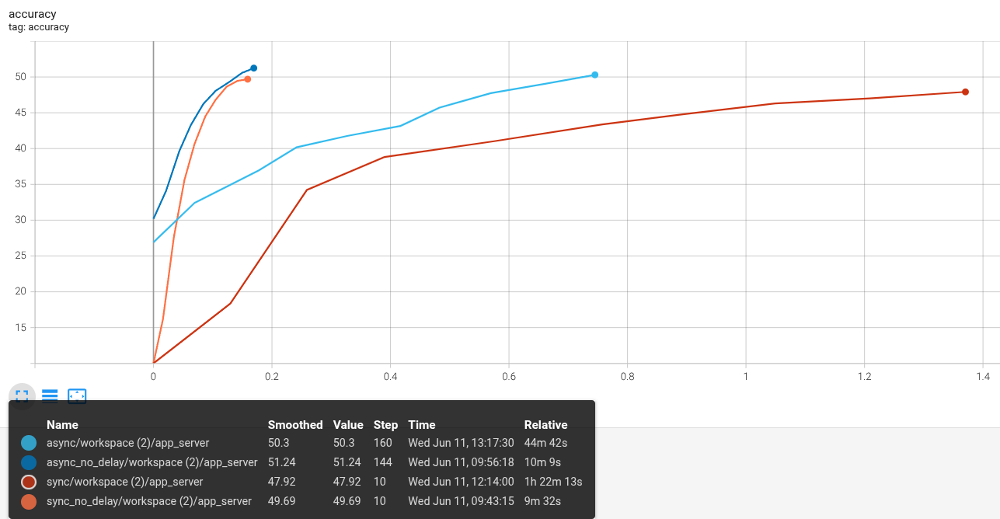

# Cross-Edge Federated Learning
## Overview
This guide provides step-by-step instructions for cross-edge federated learning functionality using simulated/real devices with NVFlare's hierarchical edge system.

This guide supports two distinct workflows:

1. **ExecuTorch-based Cross-Edge Federated Learning** (real devices, hybrid, or simulated)
2. **Pure PyTorch Simulated Cross-Edge Federated Learning** (no real devices)

## Table of Contents
- [Setup the NVFlare System](#setup-the-nvflare-system)
- [Start the NVFlare System](#start-the-nvflare-system)
- [1. ExecuTorch-based FL](#executorch-based-fl)
- [2. Pure PyTorch Simulated Cross-Edge Federated Learning](#pure-pytorch-simulated-cross-edge-federated-learning-an-end-to-end-cifar10-example)

## Setup the NVFlare System
### Install prerequisites
Install NVFlare and the required packages for this example:
```commandline
pip install -r requirements.txt
```

To run the ExecuTorch simulated devices, you need to install the executorch pybindings with training extension (please refer to [ExecuTorch GitHub](https://github.com/pytorch/executorch/issues/8990))

### Provision the NVFlare System

We are using `nvflare provision` to provision a hierarchical NVFlare system for edge, in this example, we have a pre-defined project file `project.yml` for provisioning.

***Note: if starting from scratch, please first run `nvflare provision -e` to create a project yaml, update the settings, then run the following.***

```commandline
nvflare provision -p project.yml
```

Note that in this example, we specify `depth: 1, width: 2` and `clients: 2`, indicating a hierarchy with a topology as following:

- depth indicates the number of levels in the hierarchy, in this case, we only have 1 layer of relays. 
- width indicates the number of connections for each node, in this case, we have 2 relays connecting to the server.
- clients indicates the number of leaf clients on each relay, in this case, we have 2 leaf clients connecting to each relay.

There are two types of clints: leaf clients (C11, C12, C21, C22) and non-leaf clients (C1, C2). The leaf clients are the ones that will connect with real devices or run device simulations; while non-leaf clients are used for intermediate message updates through the hierarchy only.

For edge-device connection, we only needs the information of the leaf nodes, let's check the lcp map:
```commandline
cat /tmp/nvflare/workspaces/edge_example/prod_00/scripts/lcp_map.json
```

We can see the address and port of each leaf node, which can be used by the mobile devices to connect to the system.

```
{
    "C11": {
        "host": "localhost",
        "port": 9003
    },
    "C12": {
        "host": "localhost",
        "port": 9004
    },
    "C21": {
        "host": "localhost",
        "port": 9006
    },
    "C22": {
        "host": "localhost",
        "port": 9007
    }
}
```
## Start the NVFlare System

To start the system, run the following command:
```commandline
cd /tmp/nvflare/workspaces/edge_example/prod_00/
./start_all.sh
```

By default, it will start listening on port 4321, feel free to adjust that.

### Simulated Cross-Device Federated Learning
Assuming the previous steps are completed, we can now run the end-to-end example with the same already prepared NVFlare system.
#### Step1: Start the NVFlare System
Again, if the system is not up running yet, we first start the system, open a terminal window and run the following command:
```commandline
cd /tmp/nvflare/workspaces/edge_example/prod_00/
./start_all.sh 
```  

#### Step2: Generate Job Configs using the EdgeFedBuffRecipe API
Next, let's generate job configs for cifar10 via EdgeFedBuffRecipe API.

```commandline
python3 jobs/pt_job.py --fl_mode sync --no_delay
python3 jobs/pt_job.py --fl_mode async --no_delay
python3 jobs/pt_job.py --fl_mode sync
python3 jobs/pt_job.py --fl_mode async
```
This will generate two job configurations for basic synchronous and asynchronous training in the transfer folder of your admin startup kit (see `--output_dir` option of [pt_job.py](jobs/pt_job.py)):
- sync assumes ALL devices participate in each round
- async assumes server updates the global model and immediately dispatch it after receiving ONE device's update.

### Results
#### Federated Training v.s. Centralized Training
After the configured rounds have finished, the training is complete, now let's check the training results.

FL results are saved in `/tmp/nvflare/jobs-storage`, let's extract all `workspace` files recursively under this folder

```commandline
find /tmp/nvflare/jobs-storage -name "workspace" -type f -exec sh -c 'cd "$(dirname "{}")" && mv "$(basename "{}")" workspace.zip && unzip -o workspace.zip -d workspace/' \;
```

Then we can start TensorBoard to visualize the training results:
```commandline
tensorboard --logdir=/tmp/nvflare/
```
With the centralized training of 10 epochs, and the federated training of 10 rounds (4 local epoch per round), you should see the following results:


Red curve is the centralized training, blue is the baseline federated training with regular single-layer setting, and green is the simulated cross-device federated training.
The three learning will converge to similar accuracy, note that in this case each client holds partial data that is 1/16 of the whole training set sequentially split.

#### Synchronous v.s. Asynchronous Federated Training
Comparing synchronous (sync) vs. asynchronous (async) training, we tested an async scheme that produces a new global model once receiving 1 model update, compared to the sync scheme which requires all 16 model updates to generate a new global model. 

We compare the two schemes under two settings:
- No delay in local training by setting both **communication_delay** and **device_speed** to 0. In this case, since all devices are running in parallel and have essentially the same training data size, they are 
expected to finish local training at almost the same time, thus async scheme will not be able to accelerate the training.
- With delay in local training, we set **communication_delay** to 5 seconds, and **device_speed** to a Gaussian distribution with a large mean of 100.0, 200.0, or 400.0 seconds. 
In this case, the devices will finish local training at different times, thus async scheme is expected to accelerate the training.

For async scheme as we cast a new model whenever receiving an update, the overall expectation of additional latency will be the **mean** of all devices' latency

$(400+200+100)/3+5=238.3$

In comparison, the sync scheme has a latency of the **slowest** device to complete a local training, and under our current setting where each device is uniformly sampled from three different device types, each modeled as an independent Gaussian distribution, we have the expectation of the **max** of the three Gaussians plus the communication mean 

$400+(3/2)\pi^{-1/2}\times4+5=408.4$

So running for 10 rounds, comparing with training without delays, the async scheme will take approximately 2383 sec $\approx$ 39 min more, 
while the sync scheme will take approximately 4084 sec $\approx$ 68 min more.

Now let's take a look at the results of the two schemes. Note that here we set the global learning rate to 0.05 for the async scheme, and 1.0 for the sync scheme. To match the total number of model updates processed, we let the async scheme run for 160 model versions as compared with 10 rounds of sync training.

The global accuracy curves are shown below, with x-axis representing the relative time (in hours) of the training process, and y-axis representing the global accuracy:



The dark blue curve represents async training without delay, orange for sync training without delay. 

As expected, in this setting, the async scheme does not accelerate the training process, and both schemes converge to similar accuracy at similar time around 10 min.

The light blue curve represents async training with delay, and the red curve represents sync training with delay.

As expected, the async scheme accelerates the training process, taking 45 min, 35 min more than the no-delay scheme.
While the sync scheme takes 82 min, 72 min more than the no-delay scheme. As compared with our theoretical expectation of delays of 39 min and 68 min, the
experimental results align well with our calculation.
