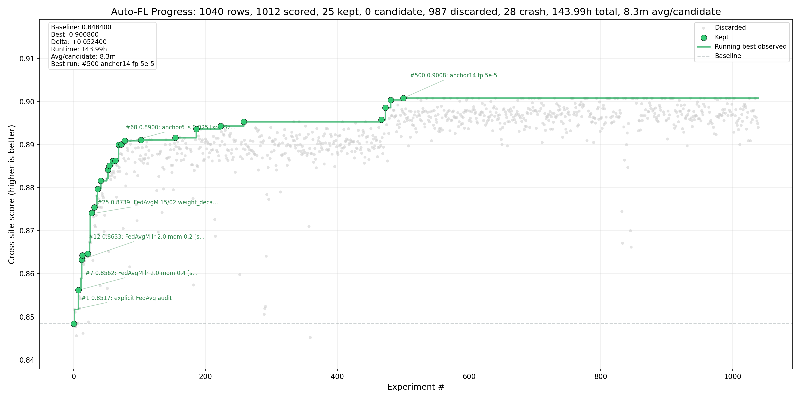

# Auto-FL NVFlare Autoresearch Campaign Report

## Executive Summary

- **Branch:** `h100-autoresearch-20260501` at `unknown`
- **Rows analyzed:** 1040 total, 1040 scored
- **Best score:** 0.900800 at experiment `#500`
- **Baseline:** 0.848400 at experiment `#0`
- **Lift:** +0.052400 absolute, 6.2% relative
- **Runtime cost:** 143.99h aggregate; 8.3m average over 1040 timed candidates
- **Agent model/effort:** Agent model: Opus 4.7 (1M context)
- **Agent/tooling cost:** Session
- **Best status:** `keep`; treat as needing reproduction unless independently repeated or marked `keep`.

- **Progress plot:** `progress.png`

## Progress Plot



## Best Candidate

| field | value |
| --- | --- |
| experiment | #500 |
| score | 0.900800 |
| delta vs baseline | +0.052400 |
| relative lift | 6.2% |
| status | keep |
| commit | no-git |
| runtime | 8.0m |
| target | client.py |
| description | anchor14 fp 5e-5 |
| artifact | /tmp/nvflare/simulation/r20_a14_fp5e5 |
| contract mode | Strict DIFF contract |

### Exact Budget / Args

```text
--n_clients 8 --num_rounds 20 --aggregation_epochs 4 --batch_size 64 --eval_batch_size 1024 --alpha 0.5 --seed 0 --model_arch moderate_cnn --max_model_params 5000000 --final_eval_clients site-1 --aggregator fedavgm --server_lr 1.94 --server_momentum 0.19 --weight_decay 5e-4 --cosine_lr_eta_min_factor 0.0001 --lr 4e-2 --momentum 0.93 --client_optimizer sgdn --label_smoothing 0.035 --grad_clip_norm 5.0 --fedproxloss_mu 5e-5 --name r20_a14_fp5e5
```

## Improvement Path

Major running-best milestones, selected by first/last and largest score jumps:

| experiment | score | jump | description | likely mechanism | source refs |
| --- | --- | --- | --- | --- | --- |
| #0 | 0.848400 | baseline | baseline weighted FedAvg 20rounds | configuration change |  |
| #1 | 0.851700 | +0.003300 | explicit FedAvg audit | configuration change |  |
| #7 | 0.856200 | +0.004500 | FedAvgM lr 2.0 mom 0.4 [src: Hsu19 FedAvgM arXiv:1909.06335] | server momentum, server diff amplification | Hsu19 FedAvgM arXiv:1909.06335 |
| #11 | 0.858900 | +0.002700 | FedAvgM lr 1.5 mom 0.4 [src: Hsu19 FedAvgM arXiv:1909.06335] | server momentum, server diff amplification | Hsu19 FedAvgM arXiv:1909.06335 |
| #12 | 0.863300 | +0.004400 | FedAvgM lr 2.0 mom 0.2 [src: Hsu19 FedAvgM arXiv:1909.06335] | server momentum, server diff amplification | Hsu19 FedAvgM arXiv:1909.06335 |
| #25 | 0.873900 | +0.006600 | FedAvgM 15/02 weight_decay 5e-4 | server momentum, server diff amplification, weight decay |  |
| #35 | 0.878100 | +0.002700 | FedAvgM 15/02 wd4e4 cosine_eta_min_factor 0.001 | server momentum, server diff amplification, weight decay |  |
| #68 | 0.890000 | +0.003700 | anchor6 label_smoothing 0.025 [src: Szegedy16 Inception arXiv:1512.00... | server momentum, server diff amplification, FedProx/client drift regularization, label smoothing, weight decay | Szegedy16 Inception arXiv:1512.00567 |
| #473 | 0.898600 | +0.002800 | anchor13 mom 0.93 Nesterov | server momentum, server diff amplification, FedProx/client drift regularization, gradient clipping, label smoothing, weight decay |  |
| #500 | 0.900800 | +0.000400 | anchor14 fp 5e-5 | server momentum, server diff amplification, FedProx/client drift regularization, gradient clipping, label smoothing, weight decay |  |

## Runtime and Reliability

| metric | value |
| --- | --- |
| total aggregate runtime | 143.99h |
| average runtime per timed candidate | 8.3m |
| timed candidates | 1040 |
| candidate rows | 0 |
| kept rows | 25 |
| crash rows | 28 |

The runtime total is aggregate candidate runtime from `runtime_seconds`, not wall-clock elapsed campaign time.

## Agent / Tooling Context

### Model / Effort Settings

Agent model and effort context provided for this report:

```text
Agent model: Opus 4.7 (1M context)
Effort: max (Maximum capability with deepest reasoning)
```

### Agent / Tooling Cost

Agent/tooling cost context provided for this report:

```text
Session
  Total cost:            $1814.09
  Total duration (API):  3h 16m 59s
  Total duration (wall): 2d 23h 6m
  Total code changes:    453 lines added, 188 lines removed
  Usage by model:
      claude-haiku-4-5:  938 input, 20 output, 0 cache read, 0 cache write ($0.0010)
       claude-opus-4-7:  3.0k input, 567.9k output, 249.6m cache read, 268.0m cache write ($1814.09)
```

### Crash / Failure Notes

| count | description |
| --- | --- |
| 2 | anchor15 + smom 0.19 + LS 0.035 + clr 4e-2 + nesterov + lr 1.... |
| 1 | FedAdam [src: Reddi21 FedOpt arXiv:2003.00295] |
| 1 | FedAvgM lr 1.5 mom 0.2 [src: Hsu19 FedAvgM arXiv:1909.06335] |
| 1 | FedAvgM lr 2.2 mom 0.1 [src: Hsu19 FedAvgM arXiv:1909.06335] |
| 1 | FedAvgM 15/02 weight_decay 1e-3 |
| 1 | FedAvgM 15/02 weight_decay 3e-4 |
| 1 | anchor4 client_momentum 0.99 |
| 1 | trimmed_fedavgm trim_count=2 |

## Literature-Derived Ideas

| source ref | rows | best score | best description | mapped mechanism | outcome |
| --- | --- | --- | --- | --- | --- |
| Foret21 SAM arXiv:2010.01412 | 4 | 0.889300 | anchor7gc sam_rho 0.02 [src: Foret21 SAM arXiv:2010.01412] | server momentum, server diff amplification, FedProx/client drift regularization, gradient clipping, label smoothing, weight decay | helped |
| Hsu19 FedAvgM arXiv:1909.06335 | 16 | 0.864700 | FedAvgM lr 1.5 mom 0.2 [src: Hsu19 FedAvgM arXiv:1909.06335] | server momentum, server diff amplification | helped |
| Karimireddy20 SCAFFOLD arXiv:1910.06378 | 2 | 0.861600 | anchor7 SCAFFOLD aggregator [src: Karimireddy20 SCAFFOLD arXiv:1910.0... | FedProx/client drift regularization, SCAFFOLD control variates, label smoothing, weight decay | helped |
| Li20 FedProx arXiv:1812.06127 | 10 | 0.886300 | anchor5 fedproxloss_mu 8e-5 [src: Li20 FedProx arXiv:1812.06127] | server momentum, server diff amplification, FedProx/client drift regularization, weight decay | helped |
| Loshchilov19 AdamW arXiv:1711.05101 | 1 | 0.100000 | anchor7 AdamW client [src: Loshchilov19 AdamW arXiv:1711.05101] | server momentum, server diff amplification, FedProx/client drift regularization, label smoothing, weight decay | not confirmed |
| Pascanu13 GradClip arXiv:1211.5063 | 4 | 0.890900 | anchor7 grad_clip_norm 5.0 [src: Pascanu13 GradClip arXiv:1211.5063] | server momentum, server diff amplification, FedProx/client drift regularization, gradient clipping, label smoothing, weight decay | helped |
| Reddi21 FedOpt | 2 | 0.818400 | fedadam server_lr 0.05 [src: Reddi21 FedOpt] | server diff amplification, FedProx/client drift regularization, gradient clipping, label smoothing, weight decay | not confirmed |
| Reddi21 FedOpt arXiv:2003.00295 | 1 | 0.000000 | FedAdam [src: Reddi21 FedOpt arXiv:2003.00295] | server diff amplification | not confirmed |
| Sutskever13 NAG ICML | 1 | 0.888300 | anchor7 SGD+Nesterov [src: Sutskever13 NAG ICML] | server momentum, server diff amplification, FedProx/client drift regularization, label smoothing, weight decay | helped |
| Szegedy16 Inception arXiv:1512.00567 | 8 | 0.890100 | anchor6 label_smoothing 0.035 [src: Szegedy16 Inception arXiv:1512.00... | server momentum, server diff amplification, FedProx/client drift regularization, label smoothing, weight decay | helped |
| Yin18 ByzantineRobust | 2 | 0.000000 | trimmed_fedavgm trim=2 [src: Yin18 ByzantineRobust] | server momentum, server diff amplification, FedProx/client drift regularization, gradient clipping, label smoothing, weight decay | not confirmed |
| Yin18 ByzantineRobust arXiv:1803.01498 | 1 | 0.789900 | anchor7 median aggregator [src: Yin18 ByzantineRobust arXiv:1803.01498] | FedProx/client drift regularization, label smoothing, weight decay | not confirmed |
| Zhang17 MixUp arXiv:1710.09412 | 4 | 0.889200 | anchor7gc mixup_alpha 0.05 [src: Zhang17 MixUp arXiv:1710.09412] | server momentum, server diff amplification, FedProx/client drift regularization, gradient clipping, label smoothing, weight decay | helped |

Source refs are extracted from `[src: ...]` markers in `results.tsv` descriptions. Check `templates/mutation_report.md` or the campaign notes for full citations and URLs.

## Null, Worse, or Unstable Ideas

| experiment | score | description | mechanism |
| --- | --- | --- | --- |
| #5 | 0.000000 | FedAdam [src: Reddi21 FedOpt arXiv:2003.00295] | server diff amplification |
| #18 | 0.000000 | FedAvgM lr 1.5 mom 0.2 [src: Hsu19 FedAvgM arXiv:1909.06335] | server momentum, server diff amplification |
| #20 | 0.000000 | FedAvgM lr 2.2 mom 0.1 [src: Hsu19 FedAvgM arXiv:1909.06335] | server momentum, server diff amplification |
| #23 | 0.000000 | FedAvgM 15/02 weight_decay 1e-3 | server momentum, server diff amplification, weight decay |
| #28 | 0.000000 | FedAvgM 15/02 weight_decay 3e-4 | server momentum, server diff amplification, weight decay |
| #48 | 0.000000 | anchor4 client_momentum 0.99 | server momentum, server diff amplification, weight decay |
| #116 | 0.000000 | trimmed_fedavgm trim_count=2 | server momentum, server diff amplification, FedProx/client drift regularization, gradient clipping, label smoothing, weight decay |
| #117 | 0.000000 | trimmed_fedavgm trim_count=1 | server momentum, server diff amplification, FedProx/client drift regularization, gradient clipping, label smoothing, weight decay |

## Recommendation

1. Reproduce the best candidate with multiple seeds or repeated runs before promotion.
2. Promote only changes that preserve the declared contract mode, or keep explicit protocol modes such as SCAFFOLD labeled separately.
3. Use the milestone table to focus follow-up sweeps on mechanisms that created durable running-best jumps.
4. Retire ideas that repeatedly crash, underperform the baseline, or add complexity without a repeatable score lift.

## Technical Appendix

### Status Counts

| status | rows |
| --- | --- |
| crash | 28 |
| discard | 987 |
| keep | 25 |

### Top Scored Rows

| rank | experiment | score | runtime | status | description |
| --- | --- | --- | --- | --- | --- |
| 1 | #500 | 0.900800 | 8.0m | keep | anchor14 fp 5e-5 |
| 2 | #522 | 0.900800 | 8.0m | discard | anchor15 verify (LS 0.035) |
| 3 | #535 | 0.900800 | 8.0m | discard | anchor15 server_lr 1.94 verify #2 |
| 4 | #536 | 0.900800 | 8.0m | discard | anchor15 lr 1.94 smom 0.19 lr 4e-2 |
| 5 | #545 | 0.900800 | 7.9m | discard | anchor15 + smom 0.19 verify #3 |
| 6 | #561 | 0.900800 | 7.9m | discard | anchor15 server_lr 1.935 |
| 7 | #563 | 0.900800 | 8.0m | discard | lr 1.935 mom 0.93 wd 5e-4 LS 0.035 |
| 8 | #572 | 0.900800 | 8.0m | discard | anchor15 lr 1.935 wd 5e-4 |
| 9 | #582 | 0.900800 | 8.0m | discard | anchor15 client_lr 4e-2 |
| 10 | #598 | 0.900800 | 8.0m | discard | anchor15 lr 1.935 smom 0.19 verify |

