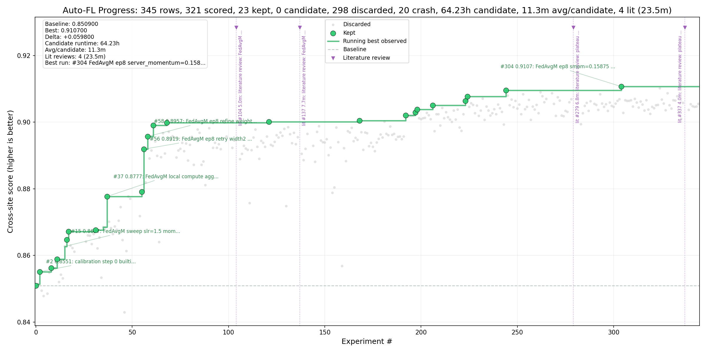

# Auto-FL NVFlare Autoresearch Campaign Report

## Executive Summary

- **Branch:** `autoresearch/h100-cifar10-algocal-20260512` at `87ff10a61`
- **Rows analyzed:** 345 total, 341 scored
- **Best score:** 0.910700 at experiment `#304`
- **Baseline:** 0.850900 at experiment `#0`
- **Lift:** +0.059800 absolute, 7.0% relative
- **Runtime cost:** 64.62h aggregate; 11.2m average over 345 timed candidates
- **Agent model/effort:** Agent model/effort telemetry unavailable in this Codex runtime; no real model or effort output was pasted into the re...
- **Agent/tooling cost:** Agent cost telemetry unavailable in this Codex runtime; no real cost output was pasted into the reporting prompt. Exp...
- **Best status:** `keep`; treat as needing reproduction unless independently repeated or marked `keep`.

- **Progress plot:** `progress.png`

## Progress Plot



## Best Candidate

| field | value |
| --- | --- |
| experiment | #304 |
| score | 0.910700 |
| delta vs baseline | +0.059800 |
| relative lift | 7.0% |
| status | keep |
| commit | 4b51b84a7 |
| runtime | 9.3m |
| target | tasks/cifar10/client.py |
| description | FedAvgM ep8 server_momentum=0.15875 local_train_steps=990 label_smoothing=0.01 mixup_alpha=0.03 weight_decay=3.5e-4 eta_min_factor=0.001 client_momentum=0.890 |
| artifact | /tmp/nvflare/simulation/r141_lts990_ls001_mix003_wd35e5_cm0890_eta001_sm015875 |
| contract mode | Strict DIFF contract |

### Exact Budget / Args

```text
--n_clients 8 --num_rounds 20 --aggregation_epochs 8 --local_train_steps 990 --batch_size 64 --eval_batch_size 1024 --alpha 0.5 --seed 0 --model_arch moderate_cnn --max_model_params 5000000 --final_eval_clients site-1 --aggregator fedavgm --server_lr 1.75 --server_momentum 0.15875 --weight_decay 3.5e-4 --momentum 0.890 --mixup_alpha 0.03 --cutmix_alpha 0.0 --label_smoothing 0.01 --cosine_lr_eta_min_factor 0.001 --name r141_lts990_ls001_mix003_wd35e5_cm0890_eta001_sm015875
```

## Improvement Path

Major running-best milestones, selected by first/last and largest score jumps:

| experiment | score | jump | description | likely mechanism | source refs |
| --- | --- | --- | --- | --- | --- |
| #0 | 0.850900 | baseline | weighted baseline default H100 budget | configuration change |  |
| #2 | 0.855100 | +0.003700 | calibration step 0 builtin FedAvg audit | configuration change |  |
| #11 | 0.858900 | +0.002700 | FedAvgM sweep server_lr=1.5 momentum=0.4 | server momentum, server diff amplification |  |
| #15 | 0.862700 | +0.003800 | FedAvgM sweep server_lr=1.5 momentum=0.0 | server momentum, server diff amplification |  |
| #17 | 0.867200 | +0.002500 | FedAvgM refine server_lr=1.65 momentum=0.2 | server momentum, server diff amplification |  |
| #37 | 0.877700 | +0.009200 | FedAvgM local compute aggregation_epochs=8 lr=1.75 momentum=0.2 | server momentum, server diff amplification |  |
| #56 | 0.891900 | +0.012800 | FedAvgM ep8 retry width2 weight_decay=5e-4 lr=1.75 momentum=0.2 | server momentum, server diff amplification, weight decay |  |
| #58 | 0.895700 | +0.003800 | FedAvgM ep8 refine weight_decay=3e-4 lr=1.75 momentum=0.2 | server momentum, server diff amplification, weight decay |  |
| #61 | 0.899100 | +0.003400 | FedAvgM ep8 refine weight_decay=4e-4 lr=1.75 momentum=0.2 | server momentum, server diff amplification, weight decay |  |
| #304 | 0.910700 | +0.001100 | FedAvgM ep8 server_momentum=0.15875 local_train_steps=990 label_smoot... | server momentum, server diff amplification, label smoothing, weight decay |  |

## Runtime and Reliability

| metric | value |
| --- | --- |
| total aggregate runtime | 64.62h |
| average runtime per timed candidate | 11.2m |
| timed candidates | 345 |
| candidate rows | 0 |
| kept rows | 23 |
| crash rows | 20 |

The runtime total is aggregate candidate runtime from `runtime_seconds`, not wall-clock elapsed campaign time.

## Agent / Tooling Context

### Model / Effort Settings

Agent model and effort context provided for this report:

```text
Agent model/effort telemetry unavailable in this Codex runtime; no real model or effort output was pasted into the reporting prompt.
```

### Agent / Tooling Cost

Agent/tooling cost context provided for this report:

```text
Agent cost telemetry unavailable in this Codex runtime; no real cost output was pasted into the reporting prompt. Experiment runtime cost is reported from results.tsv.
```

### Crash / Failure Notes

| count | description |
| --- | --- |
| 2 | FedAvgM ep8 local_train_steps=990 label_smoothing=0.01 FedPro... |
| 1 | calibration step 6 FedAdam server_lr=1.0 beta1=0.9 beta2=0.99... |
| 1 | FedAvgM refine server_lr=1.65 momentum=0.3 |
| 1 | FedAvgM refine retry server_lr=1.65 momentum=0.1 |
| 1 | FedAvgM refine retry server_lr=1.65 momentum=0.15 |
| 1 | FedAvgM refine retry server_lr=1.65 momentum=0.25 |
| 1 | FedAvgM refine retry server_lr=1.65 momentum=0.3 |
| 1 | FedAvgM ep8 weight_decay=1e-5 lr=1.75 momentum=0.2 |

## Literature-Derived Ideas

| source ref | rows | best score | best description | mapped mechanism | outcome |
| --- | --- | --- | --- | --- | --- |
| Karimireddy20 SCAFFOLD | 3 | 0.899400 | serial retry after CUBLAS allocation failure: SCAFFOLD current best l... | SCAFFOLD control variates, label smoothing, weight decay | helped |
| Li20 FedProx | 4 | 0.892900 | FedAvgM ep8 FedProx mu=1e-5 client_momentum=0.895 server_momentum=0.1... | server momentum, server diff amplification, FedProx/client drift regularization, weight decay | helped |
| Luo21 CCVR | 1 | 0.905400 | architecture subcampaign moderate_cnn_small_head current r141 FedAvgM... | server momentum, server diff amplification, label smoothing, weight decay | helped |
| Reddi21 FedOpt | 3 | 0.811600 | FedYogi damped ep8 server_lr=0.1 tau=1e-2 client_momentum=0.895 weigh... | server diff amplification, weight decay | not confirmed |
| Sutskever13 Nesterov | 2 | 0.903700 | FedAvgM ep8 Nesterov client SGD current r141 stack server_momentum=0.... | server momentum, server diff amplification, label smoothing, weight decay | helped |
| Wu18 GroupNorm; Li21 FedBN | 2 | 0.000000 | architecture subcampaign GroupNorm moderate_cnn_norm FedAvgM local_tr... | server momentum, server diff amplification, label smoothing, weight decay | not confirmed |
| Yun19 CutMix | 4 | 0.905800 | FedAvgM ep8 local_train_steps=990 label_smoothing=0.01 cutmix_alpha=0... | server momentum, server diff amplification, label smoothing, weight decay | helped |
| Zhang18 mixup; Yoon21 FedMix | 4 | 0.896500 | FedAvgM ep8 Mixup alpha=0.05 client_momentum=0.895 server_momentum=0.... | server momentum, server diff amplification, weight decay | helped |

Source refs are extracted from `[src: ...]` markers in `results.tsv` descriptions. Check `templates/mutation_report.md` or the campaign notes for full citations and URLs.

## Null, Worse, or Unstable Ideas

| experiment | score | description | mechanism |
| --- | --- | --- | --- |
| #5 | 0.000000 | calibration step 6 FedAdam server_lr=1.0 beta1=0.9 beta2=0.99 tau=1e-3 | server diff amplification |
| #21 | 0.000000 | FedAvgM refine server_lr=1.65 momentum=0.3 | server momentum, server diff amplification |
| #22 | 0.000000 | FedAvgM refine retry server_lr=1.65 momentum=0.1 | server momentum, server diff amplification |
| #23 | 0.000000 | FedAvgM refine retry server_lr=1.65 momentum=0.15 | server momentum, server diff amplification |
| #24 | 0.000000 | FedAvgM refine retry server_lr=1.65 momentum=0.25 | server momentum, server diff amplification |
| #25 | 0.000000 | FedAvgM refine retry server_lr=1.65 momentum=0.3 | server momentum, server diff amplification |
| #50 | 0.000000 | FedAvgM ep8 weight_decay=1e-5 lr=1.75 momentum=0.2 | server momentum, server diff amplification, weight decay |
| #51 | 0.000000 | FedAvgM ep8 weight_decay=1e-3 lr=1.75 momentum=0.2 | server momentum, server diff amplification, weight decay |

## Recommendation

1. Reproduce the best candidate with multiple seeds or repeated runs before promotion.
2. Promote only changes that preserve the declared contract mode, or keep explicit protocol modes such as SCAFFOLD labeled separately.
3. Use the milestone table to focus follow-up sweeps on mechanisms that created durable running-best jumps.
4. Retire ideas that repeatedly crash, underperform the baseline, or add complexity without a repeatable score lift.

## Technical Appendix

### Status Counts

| status | rows |
| --- | --- |
| crash | 20 |
| discard | 298 |
| keep | 23 |
| literature | 4 |

### Top Scored Rows

| rank | experiment | score | runtime | status | description |
| --- | --- | --- | --- | --- | --- |
| 1 | #304 | 0.910700 | 9.3m | keep | FedAvgM ep8 server_momentum=0.15875 local_train_steps=990 label_smoothing=0.01 mixup_... |
| 2 | #324 | 0.910200 | 8.3m | discard | FedAvgM ep8 max_grad_norm=6.5 server_momentum=0.15875 local_train_steps=990 label_smo... |
| 3 | #244 | 0.909600 | 14.1m | keep | FedAvgM ep8 local_train_steps=990 label_smoothing=0.01 mixup_alpha=0.03 eta_min_facto... |
| 4 | #262 | 0.909000 | 16.1m | discard | FedAvgM ep8 local_train_steps=990 label_smoothing=0.01 mixup_alpha=0.03 eta_min_facto... |
| 5 | #268 | 0.908700 | 16.0m | discard | FedAvgM ep8 local_train_steps=990 label_smoothing=0.01 mixup_alpha=0.03 eta_min_facto... |
| 6 | #328 | 0.908700 | 8.3m | discard | FedAvgM ep8 max_grad_norm=6.25 server_momentum=0.15875 local_train_steps=990 label_sm... |
| 7 | #253 | 0.908400 | 13.5m | discard | FedAvgM ep8 local_train_steps=990 label_smoothing=0.01 mixup_alpha=0.03 eta_min_facto... |
| 8 | #293 | 0.908400 | 9.3m | discard | FedAvgM ep8 server_momentum=0.1575 local_train_steps=990 label_smoothing=0.01 mixup_a... |
| 9 | #245 | 0.908000 | 14.1m | discard | FedAvgM ep8 local_train_steps=990 label_smoothing=0.02 mixup_alpha=0.03 eta_min_facto... |
| 10 | #263 | 0.907800 | 16.1m | discard | FedAvgM ep8 local_train_steps=990 label_smoothing=0.01 mixup_alpha=0.03 eta_min_facto... |

